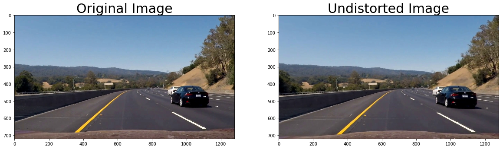
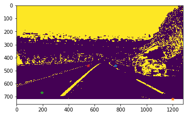
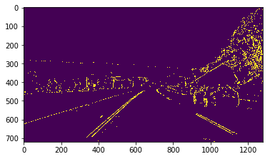
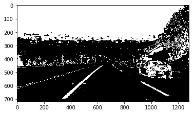
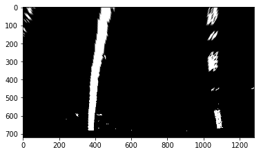
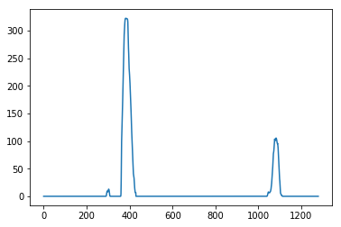
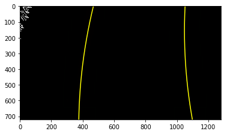
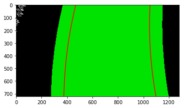
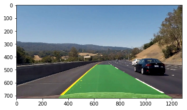

# **Advanced Lane Finding Project ** 

## The below Algorithm is applied to find lane lines on road.

### The goals / steps of this project are the following:

*1. Import all dependencies
*2. Compute the camera calibration matrix and distortion coefficients given a set of chessboard images.
*3. Apply a distortion correction to raw images.
*4. Use color transforms, gradients, etc., to create a thresholded binary image.
*5. Apply a perspective transform to rectify binary image ("birds-eye view").
*6. Detect lane pixels and fit to find the lane boundary.
*7. Determine the curvature of the lane and vehicle position with respect to center.
*8. Warp the detected lane boundaries back onto the original image.
*9. Output visual display of the lane boundaries and numerical estimation of lane curvature and vehicle position.

***Working of whole pipeline**

### Camera Calibration

#### 1. Briefly state how you computed the camera matrix and distortion coefficients. Provide an example of a distortion corrected calibration image.

I start by preparing "object points", which will be the (9,6,3) coordinates of the chessboard corners in the world. Here I am assuming the chessboard is fixed on the (x, y) plane at z=0, such that the object points are the same for each calibration image.  Thus, `objp` is just a replicated array of coordinates, and `objpoints` will be appended with a copy of it every time I successfully detect all chessboard corners in a test image.  `imgpoints` will be appended with the (x, y) pixel position of each of the corners in the image plane with each successful chessboard detection.  

I then used the output `objpoints` and `imgpoints` to compute the camera calibration and distortion coefficients using the `cv2.calibrateCamera()` function.  I applied this distortion correction to the test image using the `cv2.undistort()` function and obtained this result:



### Pipeline (single images)

#### 1. Provide an example of a distortion-corrected image.

To demonstrate this step, I will describe how I apply the distortion correction to one of the test images like this one:


#### 2. Describe how (and identify where in your code) you used color transforms, gradients or other methods to create a thresholded binary image.  Provide an example of a binary image result.

I used a combination of color and gradient thresholds to generate a binary image ( line no. 142-168  in Project_F.py).  Here's an example of my output for this step. 





#### 3. Describe how (and identify where in your code) you performed a perspective transform and provide an example of a transformed image.

The code for my perspective transform includes a function called `warp(img)`, which appears in lines 170 through 193 in the file `Project_F.py` (./Project_F.py) .  The `warp(img)` function takes as inputs an image (`img`), The source (`src`) and destination (`dst`) points are hard coded.  I chose the hardcode the source and destination points in the following manner:

```python
src=np.float32(
        [[770,461],
         [1250,657],
         [193,667],
         [567,461]    
        ])
    dst=np.float32(
        [[1250,29],
         [1250,657],
         [193,667],
         [193,29]    
        ])
```

This resulted in the following source and destination points:

| Source        | Destination   | 
|:-------------:|:-------------:| 
| 770,461       | 1250,29       | 
| 1250,657      | 1250,657      |
| 193,667       | 193,667       |
| 567,461       | 193,29        |

I verified that my perspective transform was working as expected by drawing the `src` and `dst` points onto a test image and its warped counterpart to verify that the lines appear parallel in the warped image.




#### 4. Describe how (and identify where in your code) you identified lane-line pixels and fit their positions with a polynomial?

Then I did some other stuff and fit my lane lines with a 2nd order polynomial kinda like this:






#### 5. Describe how (and identify where in your code) you calculated the radius of curvature of the lane and the position of the vehicle with respect to center.

I calculated the radius of curvature of the road using the lane lines detected . I took the average of both lines.
The code for calculating the lane lines is from 375 till 379 in Project_F.py file

#### 6. Provide an example image of your result plotted back down onto the road such that the lane area is identified clearly.

I implemented this step in lines 400 through 411 in my code in `Project_F.py` .  Here is an example of my result on a test image:




### Pipeline (video)

#### 1. Provide a link to your final video output.  Your pipeline should perform reasonably well on the entire project video (wobbly lines are ok but no catastrophic failures that would cause the car to drive off the road!).

Here's a [link to my video result](./project_video.mp4)


### Discussion

#### 1. Briefly discuss any problems / issues you faced in your implementation of this project.  Where will your pipeline likely fail?  What could you do to make it more robust?

The framwork can be made more efficient by using the advanced image prosessing techniques. Using the convnet concept the detection process can be made more efficient. I failed to detect the lane lines in the more bright part of the road and in the dark part of the road. I then tweaked my threshold values and  used the mask to correctly detect the lane lines. I finally completed the project video.